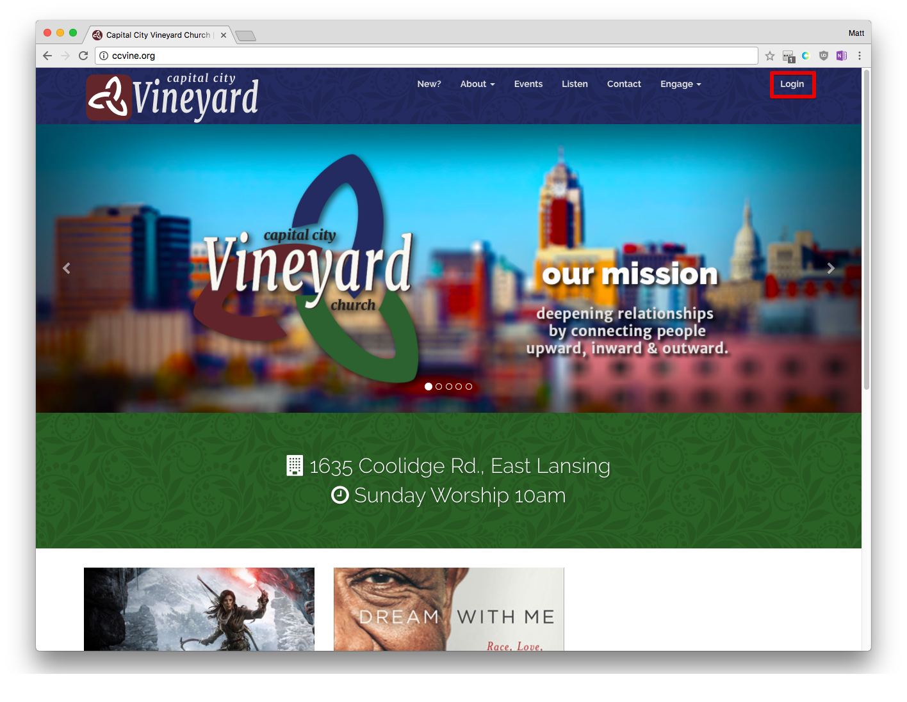
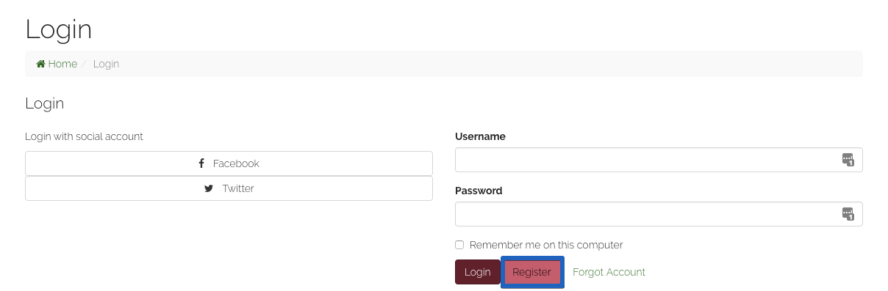

This tutorial  asume the following:

> - You are currently not signed in to our site. -  (see: How can I tell if im signed in?)
> - You have not previously signed into our site with a *Username & Password*.  - (see: I can't remember if I have an account.)
> - You are not currently on a mobile device / or a computer with a small resolution. (see: responsive design differences on mobile)

-----
### Step 0

This step is ONLY to make sure everyone is on the same page. 

> Open your browser of choice and navigate to <a href="http://ccvine.org">`http://ccvine.org`</a>

### Step 1

> On the upper right corner click **Login**

### Step 2

This page gives you several different options. For now we are consered with *Creating a new account*  
> Click **Register**.

Other options you may be looking for:
-  [Use *Facebook* to sign up for an account.](#) 
- [Use *Twitter* to sign up for an account.](#)
- [I Forgot my Account](#)

### Step 4a

This Page will collect the required information to allow you to sign up for an account. This method will not use information provided from a third-party such as *Facebook*, *Google* or *Twitter*.

> Fill out the registration form.

>Click Next When finished.

### Step 4b <small>If applicable</small>

Our site will check to see if we already have information on who you are (are you a church member, church leader ect.) It may ask you if it found a record that matches some of the information you provided on the previous page. 

>**If A line is a match:**  Select the line that matches.

or

> **If None match:** Select "None of these are me"

### Final Notes

In a few minutes you should receive an email to confirm your address. please follow steps provided in the email.

Once this is accomplished you should be able to [Log in to our website](#) with your newly created *Username & Password*. 
