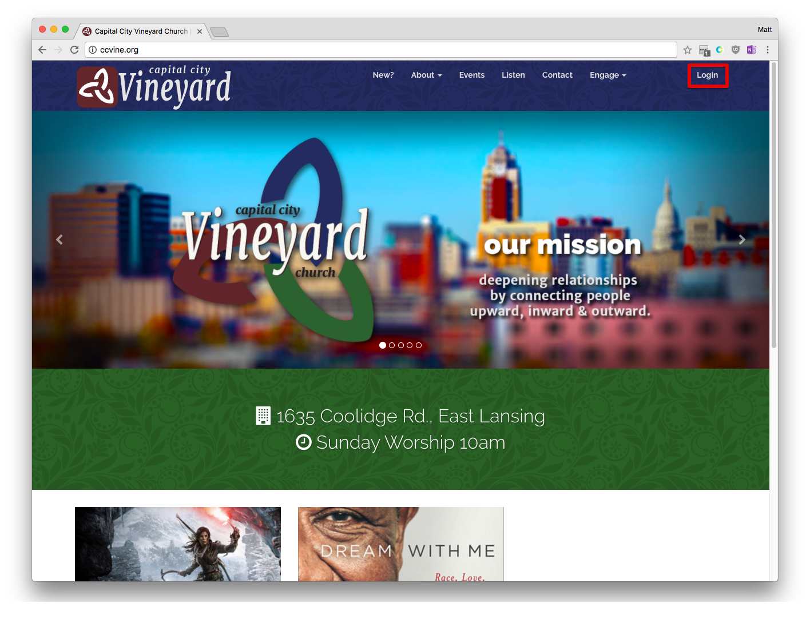
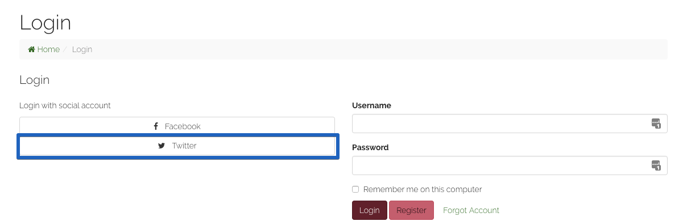
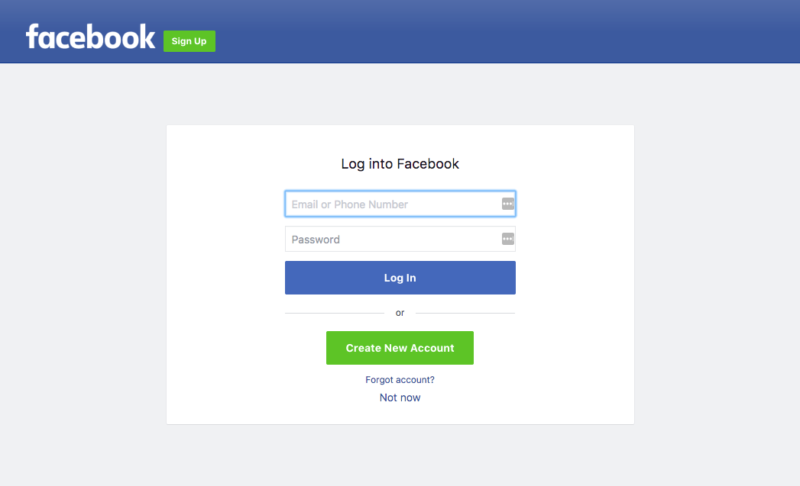
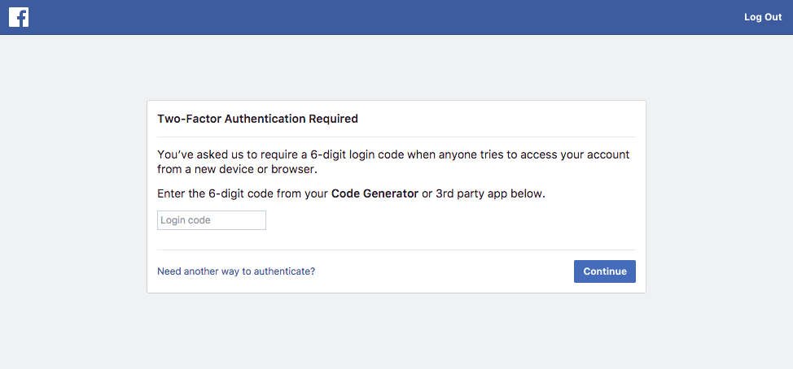
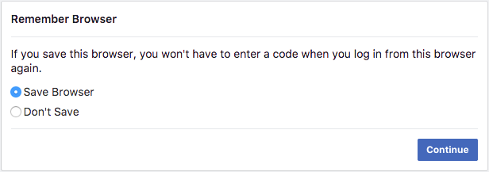
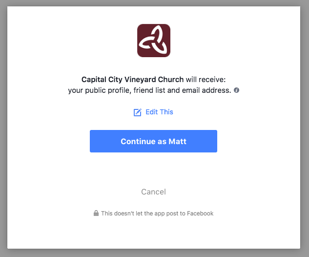

This tutorial  asume the following:
 * You have not previously signed into our site with *Facebook*. 
 * You are currently not signed in to our site with another method. (see: How can I tell if im signed in?)
 * You are aware of (or at least know how to find) your Facebook Login credencials.  I am 
 * You are not currently on a mobile device / or a computer with a small resolution. 
 
 
 ### Step 0
 > Open your browser of choice and navigate to (or open in a new tab) `http://ccvine.org.`
 

 ### Step 1
> On the upper right corner click Login.

### Step 2
 > Click  the *Facebook* button

 Here you will be sent to a *Facebook* controlled page where you will be asked to Login or authorise *Facebook.com* to identify yourself for the purposes of logging in to *ccvine.org*. 

 ### Step 3

Here you may be required to Login to facebook with your *Facebook Username* or *Phone number* and *Facebook password*
> **If Applicable:** Login to Facebook.

If you have Facebook's  **Two-Factor Authentication** Enabled (If you are unsure what this is, you most likely do not have this.)

> **If Applicable** Enter your *Two-Factor Authentication* Login code. 

> **If Applicable** Choose Wheather or not to save browser.

### Step 4

Facebook will now ask you to authorise *ccvine.org* to use some of your *Facebook.com* information so we can uniquely identify that you are part of our community. You do have the option to select what information *Facebook* Shares with our site. by clicking  the `Edit This` button. 

> **Optional:** Click *Edit This* to change what information facebook gives us. 

<small>[More information on what information we use and how we use it. ](#)</small>

This step should not need to be repeated in the future. 

> Click Continue as *You*. To

### Step 5

If successful, *Facebook.com* should have redirected you back to our website. You should see "Hello `Your name` ˘ in the navigation menu. 

### Closing Notes

